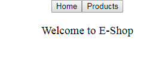
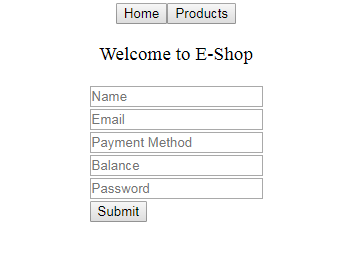
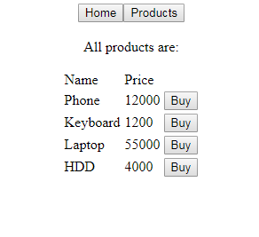

# e-shop
A rudimentary e-commerce web application.
REST api is implemented for developing this web application.
Technologies used: Spring Boot, Angular, Hibernate, H2.

## Dependencies:
- java 11
- npm 6.14.4

## To run follow the steps:

### for back-end
- cd e-shop
- mvn sprint-boot:run

### for front-end
- cd angularfrontend
- npm install
- ng serve

Screenshots:
Home:

Login:

Sign-up:

Products List:

Customer Home

